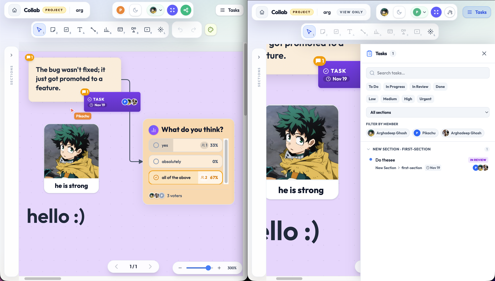
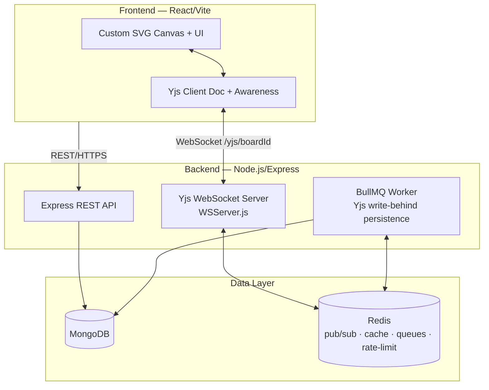

# Collaborative Realtime Workspace




A full-stack, real-time collaborative workspace where teams ideate and organize on a shared, multi-section canvas — sticky notes, task cards, connectors, polls, embeds, and more. State syncs conflict-free across clients with **Yjs CRDTs**, and the backend is built to run horizontally behind a load balancer: Redis-backed pub/sub, write-behind persistence, distributed rate limiting, health probes, and resilient external calls.

The canvas UI is **custom-built** (React + SVG, no canvas library), so the workspace is fully owned end-to-end — from the CRDT wire protocol on the server to every element on the screen.

---

## Highlights (Backend)

This project's emphasis is a backend that is safe to scale across multiple instances:

| Concern | Implementation |
|---|---|
| **CRDT sync engine** | A custom Yjs WebSocket server (`backend/crdt/WSServer.js`) attached to the HTTP server at `/yjs/<boardId>`. Implements the full `y-protocols` binary sync handshake, merges incoming deltas, and rebroadcasts to peers — conflicts resolve automatically via CRDTs, no central locking. |
| **Horizontal scaling** | Yjs document deltas fan out across instances via **Redis pub/sub** (`yjs:<boardId>` channel), so users on different Node processes stay in sync behind a load balancer. Presence (cursors, laser, user meta) is relayed the same way over an `awareness:<boardId>` channel, so a user on one instance sees the cursors of users on another. |
| **Write-behind persistence** | A **BullMQ** scheduler + worker flush in-memory `Y.Doc` state to MongoDB every 30 seconds (`backend/crdt/persistenceWorker.js`), keeping the hot sync path off the database. Dirty-flag is cleared only after the job is durably enqueued — no silent data loss on crash. |
| **History compaction** | `DocumentManager` compacts a board's Y.Doc on **room teardown** (last peer leaves) by replaying its current logical values into a throwaway fresh doc and persisting that slim snapshot — dropping accumulated CRDT tombstones and per-key history. Compacting at teardown keeps the rebuild off every client's sync handshake (the room is empty) and makes the next cold load small and cheap to replay. On a history-heavy doc this is dramatic — a synthetic test board bloated with per-key write history compacted from **68 KB → 5 KB (~93%)**. Only persists the compacted form when it's ≥ 20% smaller; nested Y.Maps (votes, comments) are reconstructed, not flattened. |
| **Hardened write path** | Client updates are validated before `Y.applyUpdate`: an oversized-payload cap (512 KB) and try/catch isolation so a malformed frame is dropped instead of crashing the server. Pure-replay updates are handled natively by Yjs (idempotent state vector). |
| **Authorization at the trust boundary** | Roles (`viewer`/`commenter`/`editor`) are enforced **per Yjs sync message**, not just at connect. A `viewer`'s write bytes are discarded before touching the shared doc — a hand-crafted WebSocket frame can't bypass the UI's read-only mode. |
| **Distributed rate limiting** | `express-rate-limit` + `rate-limit-redis` with shared counters in Redis across all instances, split into auth (50/15 min) and general API (300/15 min) tiers (`backend/middleware/rateLimiters.js`). |
| **Board-metadata cache** | Access metadata (`owner`, `collaborators`, `isPublic`, `publicRole`, workspace members) is cached in Redis (`board:meta:<id>`, 60 s TTL) and explicitly invalidated on share / unshare / publish / delete — removing a cold MongoDB read from every WebSocket connection (`backend/cache/boardCache.js`). |
| **External API resilience (design reference)** | The codebase previously included a `utils/resilience.js` with `withTimeout`, exponential-backoff `retry`, and an in-memory `CircuitBreaker` (5-failure threshold, 30 s cooldown) wrapping the (now-removed) AI calls. The file was removed with that feature; the patterns are documented in [concepts.md](concepts.md) as a reference for hardening calls to flaky external services. |
| **Health & readiness probes** | `GET /health` checks live MongoDB + Redis (`503` when down); `GET /ready` additionally verifies BullMQ workers are running, reports persist-queue backpressure (not-ready when the flush backlog exceeds a threshold), and the count of boards live in memory — concrete signals for load balancers and orchestrators. |
| **Stateless auth with revocable sessions** | Short-lived **15-min JWT access tokens** (localStorage, `Authorization: Bearer`) paired with **7-day refresh tokens** in an `httpOnly`, `SameSite` cookie. Refresh tokens are stored only as **SHA-256 hashes** server-side and verified against the DB on every refresh, so logout is real revocation — a stolen access token dies in ≤15 min and can't be silently renewed (`backend/utils/jwt.js`, `POST /users/refresh` · `/logout`). |
| **Graceful shutdown** | `SIGTERM`/`SIGINT` drain BullMQ workers, close queues, and quit Redis clients before process exit. |

---

## Design Decisions

- **A queue only where the work earns one.** BullMQ backs Yjs write-behind persistence — genuinely heavy work that is *batched* (one debounced job per board per 30 s) and must survive a crash. **Publishing a board is not queued**: it's a single indexed MongoDB write plus a cache invalidation (a few ms), so it runs **synchronously in the request** (`backend/routes/publish.routes.js`). An earlier version pushed it through a dedicated BullMQ queue + worker; that added Redis round-trips, a second process to operate, and eventual-consistency surprises (the client got `200` before the board was actually public) for no real gain — so it was removed. Reaching for a job queue per endpoint is the over-engineering trap; the queue is reserved for work that is slow, batchable, or must outlive the request.
- **Upload pipeline split by concern.** File handling is three small modules rather than one: `middleware/multer.middleware.js` (multipart parsing + a 10 MB cap + an image/video/audio MIME filter), `utils/cloudinary.js` (SDK config + an `uploadToCloudinary` helper that also cleans up the temp file), and `controllers/upload.controller.js` (the route handlers). Multer is middleware, Cloudinary is an external-service client, and the handlers are HTTP glue — keeping them apart makes each unit-testable and reusable.

## Future Improvements

- **Incremental update log.** Persistence currently writes a full `Y.encodeStateAsUpdate` snapshot on every flush, so one moved element can trigger a large write. A planned change appends per-update Yjs chunks (20–200 bytes) to a `yjsUpdates` collection and replays them on cold load, compacting into a snapshot past a log-size threshold — the standard `y-leveldb`/Hocuspocus pattern, trading replay complexity for far less write amplification. See [architecture.md](architecture.md#8-future-improvements).

---

## Features (Product)

- **Multi-section canvas** of fixed 16:9 sections with freeform / grid / column layout modes, with support for subsections nested within sections.
- **Rich elements:** sticky notes, task cards (with a dedicated task modal for title, description, assignees, labels, and due dates), text boxes, connectors, poll blocks, iframe embeds, shapes, and media.
- **Live presence:** real-time teammate cursors with name tags and a laser pointer, broadcast via Yjs Awareness.
- **Comments & voting** on elements for async decision-making.
- **Role-based sharing** (Viewer / Commenter / Editor) and public board publishing. Non-owners can leave a board or workspace; owners delete instead.
- **Secure auth** with email/password and Google OAuth 2.0 — short-lived JWT access tokens with `httpOnly`-cookie refresh tokens (revocable on logout). Each email uses one method only, and password reset is via a single-use, enumeration-safe email link.

---

## Architecture

```
.
├── backend/   # Node.js + Express + custom Yjs WebSocket server
└── frontend/  # React + Vite custom SVG canvas client
```



See [architecture.md](architecture.md) for the full design and [PRD.md](PRD.md) for the product spec.

---

## Tech Stack

### Frontend
- **Framework & UI:** React 19, Vite, React Router, Tailwind CSS v4, Lucide React
- **Real-time & Sync:** Yjs, `y-websocket` (custom SVG canvas synchronization)
- **Auth & Utilities:** `jwt-decode`, React Hot Toast

### Backend
- **Core Server:** Node.js, Express 5
- **Real-time & CRDT:** Yjs, `y-protocols`, `ws`
- **Database & ORM:** MongoDB, Mongoose
- **Caching, Pub/Sub & Queues:** Redis, `ioredis`, BullMQ, `rate-limit-redis`
- **Authentication & Security:** JWT (`jsonwebtoken`), Google OAuth 2.0, `bcryptjs`
- **External Services:** Cloudinary, Nodemailer

---

## Getting Started

### Prerequisites
- Node.js >= 18
- A MongoDB instance
- A Redis instance
- Google OAuth credentials (for auth)

### Backend

```bash
cd backend
npm install
cp .env.example .env   # then fill in the values
npm run dev
```

### Frontend

```bash
cd frontend
npm install
cp .env.example .env   # then fill in the values
npm run dev
```

The frontend runs on `http://localhost:5173` and talks to the backend on `http://localhost:3030`.

See [backend/README.md](backend/README.md) and [frontend/README.md](frontend/README.md) for environment-variable details.

---