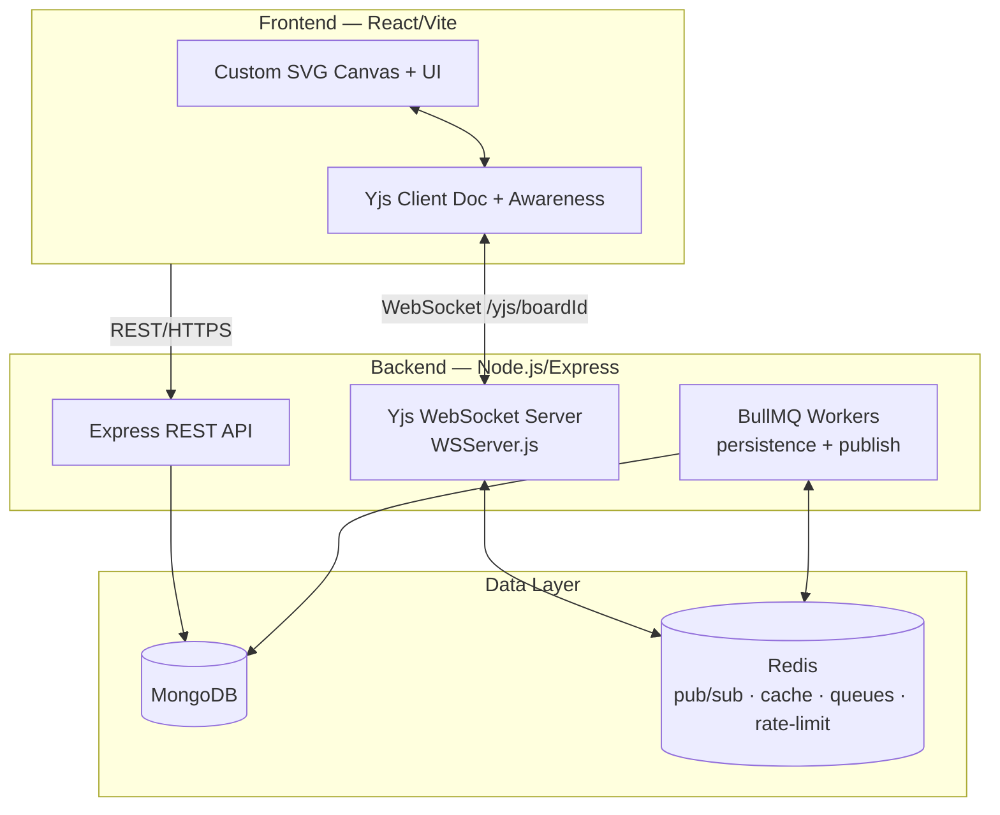

# Collaborative Realtime Workspace


A full-stack, real-time collaborative workspace where teams ideate and organize on a shared, multi-page canvas — sticky notes, Kanban cards, connectors, polls, embeds, and more. State syncs conflict-free across clients with **Yjs CRDTs**, and the backend is built to run horizontally behind a load balancer: Redis-backed pub/sub, write-behind persistence, distributed rate limiting, health probes, and resilient external calls.

The canvas UI is **custom-built** (React + SVG, no canvas library), so the workspace is fully owned end-to-end — from the CRDT wire protocol on the server to every element on the screen.

---

## Highlights (Backend)

This project's emphasis is a backend that is safe to scale across multiple instances:

| Concern | Implementation |
|---|---|
| **CRDT sync engine** | A custom Yjs WebSocket server (`backend/crdt/WSServer.js`) attached to the HTTP server at `/yjs/<boardId>`. Implements the full `y-protocols` binary sync handshake, merges incoming deltas, and rebroadcasts to peers — conflicts resolve automatically via CRDTs, no central locking. |
| **Horizontal scaling** | Yjs document deltas fan out across instances via **Redis pub/sub** (`yjs:<boardId>` channel), so users on different Node processes stay in sync behind a load balancer. Presence (cursors, laser, user meta) is relayed the same way over an `awareness:<boardId>` channel, so a user on one instance sees the cursors of users on another. |
| **Write-behind persistence** | A **BullMQ** scheduler + worker flush in-memory `Y.Doc` state to MongoDB every 30 seconds (`backend/crdt/persistenceWorker.js`), keeping the hot sync path off the database. Dirty-flag is cleared only after the job is durably enqueued — no silent data loss on crash. |
| **History compaction** | `DocumentManager` compacts each Y.Doc by replaying logical values into a fresh doc, dropping accumulated CRDT tombstones. Runs **asynchronously** (`setImmediate`) so it never blocks the cold-load sync handshake; the freshly built doc is swapped in atomically and attached peers are re-synced. Only runs when the compacted form is ≥ 20% smaller; nested Y.Maps (votes, comments) are reconstructed, not flattened. |
| **Hardened write path** | Client updates are validated before `Y.applyUpdate`: an oversized-payload cap (512 KB) and try/catch isolation so a malformed frame is dropped instead of crashing the server. Pure-replay updates are handled natively by Yjs (idempotent state vector). |
| **Authorization at the trust boundary** | Roles (`viewer`/`commenter`/`editor`) are enforced **per Yjs sync message**, not just at connect. A `viewer`'s write bytes are discarded before touching the shared doc — a hand-crafted WebSocket frame can't bypass the UI's read-only mode. |
| **Distributed rate limiting** | `express-rate-limit` + `rate-limit-redis` with shared counters in Redis across all instances, split into auth (50/15 min) and general API (300/15 min) tiers (`backend/middleware/rateLimiters.js`). |
| **Board-metadata cache** | Access metadata (`owner`, `collaborators`, `isPublic`, `publicRole`, workspace members) is cached in Redis (`board:meta:<id>`, 60 s TTL) and explicitly invalidated on share / unshare / publish / delete — removing a cold MongoDB read from every WebSocket connection (`backend/cache/boardCache.js`). |
| **External API resilience** | `backend/utils/resilience.js` provides `withTimeout`, exponential-backoff `retry`, and an in-memory `CircuitBreaker` (5 failure threshold, 30 s cooldown). These are not currently wired to an active route — the AI feature was removed — but remain as production-grade utilities. |
| **Health & readiness probes** | `GET /health` checks live MongoDB + Redis (`503` when down); `GET /ready` additionally verifies BullMQ workers are running, reports persist-queue backpressure (not-ready when the flush backlog exceeds a threshold), and the count of boards live in memory — concrete signals for load balancers and orchestrators. |
| **Async publishing** | A BullMQ queue + worker produces a read-only public snapshot of a board off the request path (`backend/jobs/`). |
| **Graceful shutdown** | `SIGTERM`/`SIGINT` drain BullMQ workers, close queues, and quit Redis clients before process exit. |

---

## Future Improvements

- **Incremental update log.** Persistence currently writes a full `Y.encodeStateAsUpdate` snapshot on every flush, so one moved element can trigger a large write. A planned change appends per-update Yjs chunks (20–200 bytes) to a `yjsUpdates` collection and replays them on cold load, compacting into a snapshot past a log-size threshold — the standard `y-leveldb`/Hocuspocus pattern, trading replay complexity for far less write amplification. See [architecture.md](architecture.md#8-future-improvements).

---

## Features (Product)

- **Multi-page canvas** of fixed 16:9 slides with freeform / grid / column layout modes.
- **Rich elements:** sticky notes, Kanban cards (labels, assignees, subcards, due dates), text boxes, connectors, poll blocks, iframe embeds, shapes, and media.
- **Live presence:** real-time teammate cursors with name tags and a laser pointer, broadcast via Yjs Awareness.
- **Comments & voting** on elements for async decision-making.
- **Role-based sharing** (Viewer / Commenter / Editor) and public board publishing. Non-owners can leave a board or workspace; owners delete instead.
- **Secure auth** with email/password and Google OAuth 2.0 (JWT access/refresh).

---

## Architecture

```
.
├── backend/   # Node.js + Express + custom Yjs WebSocket server
└── frontend/  # React + Vite custom SVG canvas client
```



See [architecture.md](architecture.md) for the full design and [PRD.md](PRD.md) for the product spec.

---

## Tech Stack

### Frontend
- **Framework & UI:** React 19, Vite, React Router, Tailwind CSS v4, Lucide React
- **Real-time & Sync:** Yjs, `y-websocket` (custom SVG canvas synchronization)
- **Auth & Utilities:** `jwt-decode`, React Hot Toast

### Backend
- **Core Server:** Node.js, Express 5
- **Real-time & CRDT:** Yjs, `y-protocols`, `ws`
- **Database & ORM:** MongoDB, Mongoose
- **Caching, Pub/Sub & Queues:** Redis, `ioredis`, BullMQ, `rate-limit-redis`
- **Authentication & Security:** JWT (`jsonwebtoken`), Google OAuth 2.0, `bcryptjs`
- **External Services:** Cloudinary, Nodemailer

---

## Getting Started

### Prerequisites
- Node.js >= 18
- A MongoDB instance
- A Redis instance
- Google OAuth credentials (for auth)

### Backend

```bash
cd backend
npm install
cp .env.example .env   # then fill in the values
npm run dev
```

### Frontend

```bash
cd frontend
npm install
cp .env.example .env   # then fill in the values
npm run dev
```

The frontend runs on `http://localhost:5173` and talks to the backend on `http://localhost:3030`.

See [backend/README.md](backend/README.md) and [frontend/README.md](frontend/README.md) for environment-variable details.

---