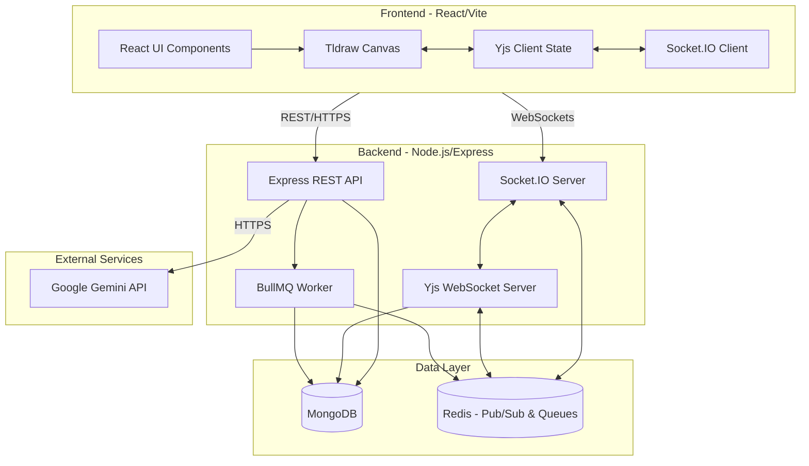

# Architecture Document: Collaborative Whiteboard Platform

## 1. System Overview

The Collaborative Whiteboard Platform is a full-stack, real-time application designed to allow multiple users to ideate, map, and organize information on an infinite canvas. The system leverages Conflict-free Replicated Data Types (CRDTs) to ensure seamless synchronization across concurrent clients.

The architecture is split into a distinct **Frontend** (Client) and **Backend** (Server), housed in a monorepo structure.

---

## 2. Technology Stack

### 2.1 Frontend (Client-Side)
- **Framework:** React 18 with Vite for fast bundling and development.
- **Canvas Engine:** [Tldraw](https://tldraw.dev/) - Provides the infinite canvas UI, drawing tools, and standard whiteboard capabilities (shapes, sticky notes, etc.).
- **Real-Time Sync Engine:** Yjs + `y-websocket` - Handles CRDT-based state synchronization across multiple clients.
- **Styling:** Tailwind CSS / Vanilla CSS.

### 2.2 Backend (Server-Side)
- **Runtime & Framework:** Node.js, Express.js.
- **Real-Time Communication:** 
  - Socket.IO for general event signaling and presence.
  - Yjs WebSocket Server (`y-websocket`) for CRDT state syncing.
- **Database:** MongoDB (via Mongoose) for persistent storage of user profiles, board metadata, and historical document states.
- **Caching & Pub/Sub:** Redis
  - Used as an adapter for Socket.IO to scale horizontally across multiple instances.
  - Used by Yjs for cross-instance Pub/Sub to sync documents across multiple server nodes.
  - Caches board access metadata (`board:meta:<id>`, 60s TTL) to avoid a cold MongoDB read on every WebSocket connection.
  - Backs the distributed rate-limit counters so limits hold globally across instances.
- **Background Jobs:** BullMQ (backed by Redis) for asynchronous processing, specifically for publishing read-only views of boards.
- **Rate Limiting:** `express-rate-limit` + `rate-limit-redis` for per-client request throttling with a shared Redis store.
- **External APIs:** Google Gemini API for AI-powered brainstorming features, wrapped with timeout/retry/circuit-breaker resilience.

---

## 3. High-Level Architecture Diagram

---

## 4. Core Components & Workflows

### 4.1 Real-Time Synchronization (Yjs CRDT)
The core collaborative experience is powered by Yjs.
1. **Local Mutations:** When a user draws or edits, the local Tldraw instance updates the local Yjs document (`Y.Doc`).
2. **Broadcasting:** The local `Y.Doc` calculates the delta (changes) and sends it over WebSockets (`y-websocket`) to the backend.
3. **Server Resolution:** The backend Yjs server receives the update, merges it, and broadcasts it to all other connected clients in the same room. Redis Pub/Sub ensures that even if users are connected to different Node.js server instances, they receive the updates.
4. **Conflict Resolution:** Because Yjs uses CRDTs, conflicting edits (e.g., two people editing the same sticky note) are resolved automatically and consistently across all clients without a centralized locking mechanism.

### 4.2 Data Persistence
While CRDTs handle in-memory syncing, the data must be persisted.
- The Yjs server periodically saves the encoded state vector of the document to **MongoDB**.
- When a client connects to a board, the server fetches the latest state from MongoDB and initializes the `Y.Doc` before allowing real-time websocket connections.

### 4.3 Asynchronous Job Processing (BullMQ)
Tasks that are computationally expensive or non-blocking are offloaded to background workers.
- **Board Publishing:** When a user requests to "Publish" a board, an Express route queues a job in BullMQ.
- The worker processes the job (e.g., aggregating data, generating a static snapshot, or modifying access rights in MongoDB) and updates the job status, freeing up the main thread to handle websocket traffic.

### 4.4 Authentication & Authorization
- **Auth:** Managed via JWT and Google OAuth 2.0. Users receive a JWT upon login which is passed in HTTP headers and WebSocket connections.
- **Roles:** The application supports Viewer, Commenter, and Editor roles.
- **Per-message enforcement (trust boundary):** Authentication is not authorization. The Yjs WebSocket server (`backend/crdt/WSServer.js`) resolves each connecting user's effective role from the cached board metadata (owner ⇒ editor, collaborator ⇒ their role, otherwise the board's `publicRole`). The `MSG_SYNC` handler then dispatches on the Yjs sub-message type: read requests (`SyncStep1`) are always served, but write paths (`SyncStep2` / `Update`) are applied **only** for write-capable roles. A `viewer`'s update bytes are discarded without ever touching the shared `Y.Doc`, so a hand-crafted WebSocket frame cannot bypass the UI's read-only mode.

### 4.5 Production Resilience & Operations
- **Health & Readiness Probes:** `GET /health` reports liveness with live MongoDB and Redis connection checks (`503` when a dependency is down); `GET /ready` additionally verifies the BullMQ workers are running. These give load balancers and Kubernetes a concrete signal for routing and restarts.
- **Distributed Rate Limiting:** REST routes are throttled via `express-rate-limit` backed by a shared Redis store (`rate-limit-redis`). Because the counters live in Redis rather than process memory, the limit is enforced globally across every Node.js instance behind the load balancer — in-memory counters would otherwise multiply the effective limit by the instance count. Separate tiers protect auth, AI, and general API routes.
- **Board-Metadata Cache:** Validating board access on every WebSocket connection previously required a cold `Whiteboard.findOne()`. The access slice (`owner`, `collaborators`, `isPublic`, `publicRole`) is now cached in Redis (`board:meta:<id>`, 60s TTL) and explicitly invalidated on share / unshare / publish / unpublish / delete, keeping reads correct while shedding DB load on the hot connection path.
- **External API Resilience (Gemini):** AI calls are wrapped with a 10s request timeout, exponential-backoff retries (3 attempts, transient errors only), and a shared in-memory circuit breaker that opens after 5 consecutive failures and half-opens after a 30s cooldown. This fails fast during a Gemini outage instead of queuing hundreds of hanging requests; an open circuit surfaces as `503` to the client.

---

## 5. Directory Structure Mapping

- `/frontend/src/Components`: React UI elements (WhiteboardRoom, Modals, Auth).
- `/frontend/src/crdt`: Yjs integration logic with Tldraw (`useYjsBoard.js`).
- `/backend/models`: Mongoose schemas for Users, Boards, etc.
- `/backend/Routes & /Controllers`: Express REST API endpoints.
- `/backend/socket & /crdt`: WebSocket and Yjs server-side logic.
- `/backend/jobs`: BullMQ worker definitions and queue processing logic.
- `/backend/RedisHelperFunctions`: Utility functions for Redis pub/sub and state management.
- `/backend/cache`: Redis-backed board-metadata cache (`boardCache.js`) with role resolution and invalidation helpers.
- `/backend/middleware`: Auth, socket auth, and the Redis-backed rate limiters (`rateLimiters.js`).
- `/backend/utils`: Cross-cutting helpers, including the resilience primitives (`resilience.js`: timeout, retry, circuit breaker).
- `/backend/Routes/healthRoutes.js`: `/health` and `/ready` probe endpoints.

---

## 6. Scalability Considerations
- **Horizontal Scaling:** Because WebSocket connections are stateful, the backend utilizes the Redis adapter for Socket.IO. This allows multiple Node.js instances to be run behind a load balancer. Yjs cross-instance communication is also handled via Redis pub/sub.
- **Shared State Over Per-Process State:** Rate-limit counters and board-access metadata are stored in Redis rather than process memory, so they remain consistent as the fleet scales. The app trusts the first proxy hop (`trust proxy`) so per-client rate limiting keys on the real client IP behind the load balancer.
- **DB Load Shedding:** The board-metadata cache removes a MongoDB read from the hot WebSocket connection path; only cold rooms (no in-memory `Y.Doc`) fall through to the database.
- **Health-Aware Routing:** `/health` and `/ready` let the load balancer / orchestrator route around degraded or not-yet-ready nodes instead of sending them traffic.
- **Document Size limits:** As boards grow, the CRDT history can become large. The system should periodically "garbage collect" or compact Yjs states when saving to MongoDB to keep initial load times fast.
