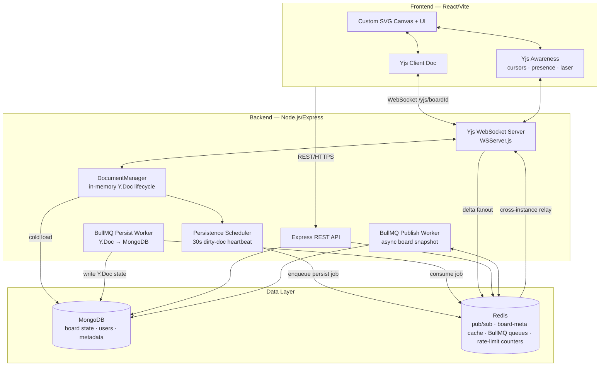

# Architecture Document: Collaborative Realtime Workspace

## 1. System Overview

The Collaborative Realtime Workspace is a full-stack, real-time application that lets multiple users collaborate on a shared, multi-page canvas. The system uses Conflict-free Replicated Data Types (CRDTs) via **Yjs** for concurrent-edit synchronization, and is designed to run horizontally across multiple Node.js instances behind a load balancer.

The monorepo has two independently deployable apps:

- **Frontend** (`/frontend`) — React 19 + Vite, custom SVG canvas, Yjs CRDT client
- **Backend** (`/backend`) — Node.js + Express, custom Yjs WebSocket server, BullMQ workers

---

## 2. Technology Stack

### 2.1 Frontend

| Concern | Choice |
|---|---|
| Framework | React 19, Vite |
| Canvas | Custom SVG (no third-party canvas library) |
| Realtime sync | Yjs + `y-websocket` (`WebsocketProvider`) |
| Presence | Yjs Awareness protocol |
| Routing | React Router |
| Styling | Tailwind CSS |
| Auth | JWT (access/refresh), Google OAuth 2.0 |

### 2.2 Backend

| Concern | Choice |
|----|----|
| Runtime | Node.js, Express.js |
| WebSocket | `ws` library (native, not Socket.IO) |
| CRDT sync | `yjs`, `y-protocols`, `lib0` |
| Database | MongoDB + Mongoose |
| Cache / Pub-Sub | Redis (`redis` + `ioredis`) |
| Background jobs | BullMQ + ioredis |
| AI | ~~Google Gemini API~~ (removed) |
| Auth | `bcryptjs`, `jsonwebtoken`, `google-auth-library` |
| Rate limiting | `express-rate-limit` + `rate-limit-redis` |
| Media | Cloudinary + multer |
| Email | nodemailer |

---

## 3. High-Level Architecture



---

## 4. Backend Components

### 4.1 Yjs WebSocket Server (`crdt/WSServer.js`)

The realtime core. A custom WebSocket server that implements the full `y-protocols` binary sync handshake using the `ws` library — no Hocuspocus or y-websocket server adapter.

**Startup:** `setupYjsWSServer(httpServer, redisPub, redisSub)` intercepts HTTP upgrade events at the `/yjs/` path prefix. All other upgrade requests are passed through (e.g., to other middleware).

**Connection lifecycle:**

1. **Auth buffering** — early messages from the client are buffered while async authentication runs, so the client's `SyncStep1` is never dropped.
2. **JWT verification** — token extracted from the `?token=` query param and verified. Invalid tokens close the connection immediately.
3. **Role resolution** — `resolveRole(boardMeta, userEmail)` determines the effective role:
   - Owner → `'editor'`
   - Named collaborator → their assigned role
   - Workspace member → `'viewer'` baseline
   - Public board → `publicRole` (default `'viewer'`)
   - Otherwise → `null` (connection closed)
4. **Doc load** — `documentManager.getDoc(boardId)` returns the in-memory Y.Doc, loading from MongoDB on first access (concurrent load requests deduplicated with a pending-promise map).
5. **Awareness setup** — sends current peer states to the new client; relays subsequent awareness changes to all room peers.
6. **Sync handshake** — sends `SyncStep1` (state vector) immediately, then proactively sends `SyncStep2` (full encoded state) to bring the client up to date without waiting for a second round-trip.
7. **Message dispatch:**
   - `MSG_SYNC (0)` — reads the y-protocol sub-message type:
     - `SyncStep1` / `SyncStep2` — always served (read path)
     - `Update` — applied **only** for write-capable roles (`editor`, `commenter` for allowed ops); viewers' bytes are discarded before `Y.applyUpdate` is called
   - `MSG_AWARENESS (1)` — relayed to all other room peers **and** published to `awareness:<boardId>` on Redis for cross-instance relay
8. **Update validation (`applyClientUpdate`)** — write-path updates are not handed to `Y.applyUpdate` blindly. Each is guarded by two checks first, so a buggy or hostile client can't stall the event loop or crash the process:
   - **Size cap** — updates larger than `MAX_UPDATE_BYTES` (512 KB) are dropped before parsing.
   - **Malformed-payload isolation** — `Y.applyUpdate` is wrapped in try/catch; a corrupt frame is logged and dropped rather than taking down the server for every peer. Pure-replay updates (already-seen operations) are handled natively by Yjs — re-applying them is idempotent via the state vector mechanism.
9. **Cross-instance fanout** — after applying an update locally, publishes the raw binary to `yjs:<boardId>` on Redis. Subscriber handler on each instance applies the update to its local Y.Doc copy and rebroadcasts to its local peers.
10. **Disconnect cleanup** — removes the connection from `DocumentManager`, evicts only that connection's `clientId` from the Awareness instance, broadcasts the removal to remaining local peers, and publishes it to `awareness:<boardId>` on Redis so other instances drop the departed peer's ghost cursor.

**RBAC is enforced at the message level, not just at connect.** A viewer connecting with a raw WebSocket client and replaying update frames will have every write discarded.

---

### 4.2 Document Manager (`crdt/DocumentManager.js`)

Manages the in-memory lifecycle of all active `Y.Doc` instances.

**State:**
- `docs: Map<boardId, Y.Doc>` — hot boards
- `dirtyDocs: Set<boardId>` — boards with unflushed changes
- `connections: Map<boardId, Set<WebSocket>>` — active peers per board
- `pendingLoads: Map<boardId, Promise<Y.Doc>>` — deduplicates concurrent cold loads

**Cold load (`_loadDoc`):**
1. Fetches board from MongoDB (lean query).
2. Applies stored `yjsState` buffer to a fresh `Y.Doc` via `Y.applyUpdate`.
3. Returns the doc. The `update` listener (mark-dirty + broadcast + Redis fanout) is registered once per room by WSServer on the first connection.

**History compaction (`_compactState`, run on room teardown):**
- Computes `Y.encodeStateAsUpdate(ydoc)` to measure current size.
- Skips (returns `null`) if < 64 KB (`COMPACT_MIN_BYTES`).
- Deep-clones all top-level shared types into a throwaway fresh `Y.Doc` inside a transaction:
  - Plain JSON values (elements, pages) are set directly.
  - Nested Y.Maps (votes, comments) are recursively reconstructed as new `Y.Map` instances, so CRDT merge semantics survive a reload.
- Encodes the fresh doc. If compacted size ≤ 80% of original (`COMPACT_SAVE_RATIO`), returns the slim bytes; otherwise returns `null` and the caller persists the un-compacted state. The throwaway doc is always destroyed.
- **Representative savings:** a synthetic board bloated with a long per-key write history (repeated updates to the same elements) compacted from **68 KB → 5 KB (~93%)** in testing. Real-world ratios depend on edit patterns — a doc whose size is mostly live content rather than history compacts little (and is correctly skipped by the 20%-savings gate); a doc dominated by drag/redo history compacts heavily.
- **Runs only on room teardown**, from `_flushIfDirty` when the last peer leaves — never mid-session, never on the cold-load handshake. This is deliberate:
  - The rebuild (encode → deep-clone → re-encode) can block the event loop for 50–200 ms on a large doc. At teardown the room is empty, so no client's sync handshake waits on it.
  - We're already encoding the doc to flush it at teardown, so compaction piggybacks on a write that has to happen anyway, and the *slim* snapshot is what lands in MongoDB — so the next cold load reads small bytes and replays cheaply.
  - Because no socket holds the doc reference at this point, there is **no live doc to swap and nothing to rewire** — the doc is encoded to a snapshot and then GC'd normally. (The earlier design compacted on cold load and swapped the live `Y.Doc` instance under active connections, which forced an `onDocSwapped` listener-rewire and a per-message fresh-doc lookup; teardown compaction removes all of that.)
- **Tradeoff:** a room that never goes idle never re-compacts while hot; its tombstone growth is compacted the next time it goes empty and is reloaded. Given the 5-minute idle eviction, that happens often in practice, and the cost of *not* compacting a hot room is only larger in-memory/MongoDB state, never incorrectness.

**Dirty tracking:**
- `ydoc.on('update')` → `markDirty(boardId)`
- `peekDirtyIds()` — non-destructive snapshot for the scheduler
- `clearDirty(boardIds)` — called by scheduler after durable enqueue

**GC (`_scheduleGC`):**
- Fires 5 minutes after the last peer disconnects (`GC_DELAY_MS = 300_000`).
- If the doc is still dirty when the timer fires, reschedules and waits for persistence.
- Once clean, destroys the Y.Doc, removes from `docs`, and calls the eviction callback.

---

### 4.3 Persistence Scheduler (`crdt/persistenceScheduler.js`)

A 30-second `setInterval` heartbeat that drives write-behind persistence:

1. Calls `documentManager.peekDirtyIds()` to get the current dirty set.
2. For each dirty board, enqueues a BullMQ job `{ boardId }` with `jobId: persist-<boardId>` (BullMQ deduplicates by jobId — no queue buildup if a board stays hot).
3. Calls `documentManager.clearDirty(ids)` **only after** the jobs are durably enqueued in Redis — if enqueue fails, the doc stays dirty and retries on the next tick.

---

### 4.4 Persistence Worker (`crdt/persistenceWorker.js`)

BullMQ worker consuming the `yjs-persist` queue (concurrency 5):

1. Reads the in-memory Y.Doc via `documentManager.encodeState(boardId)`.
2. If the board has been GC'd from memory, the job is a no-op (returns early).
3. Calls `Whiteboard.updateOne({ id: boardId }, { $set: { yjsState: Buffer } })`.
4. On any failure, re-marks the board dirty so the next scheduler tick retries.

---

### 4.5 Board Metadata Cache (`cache/boardCache.js`)

Avoids a cold MongoDB read on every WebSocket connection.

**Cached payload (`board:meta:<boardId>`, TTL 60 s):**
```json
{
  "owner": "email",
  "collaborators": [{ "email": "...", "role": "editor|commenter|viewer" }],
  "isPublic": true,
  "publicRole": "viewer",
  "workspaceMembers": ["email", ...]
}
```

**Role resolution (`resolveRole(meta, userEmail)`):**
- Owner → `'editor'`
- Named collaborator → their role
- Workspace member → `'viewer'`
- Public board → `meta.publicRole`
- Otherwise → `null`

**Invalidation** (`invalidateBoardMeta(boardId)`) — called on share, unshare, publish, unpublish, delete, and when a collaborator leaves a board or workspace. Next access falls through to MongoDB and repopulates the cache.

**Leaving** — a non-owner collaborator can remove themselves from a board (`DELETE /boards/leave/:id`) or a workspace (`DELETE /workspaces/:id/leave`, which also strips them from that workspace's boards). Owners are rejected — they must delete instead. Each path invalidates the affected boards' metadata cache so the next sync connection re-resolves the departed user's role to `null`.

---

### 4.6 Rate Limiting (`middleware/rateLimiters.js`)

Three `express-rate-limit` instances backed by a shared `RedisStore`:

| Tier | Limit | Applied to |
|---|---|---|
| Auth | 50 req / 15 min | `/users/*` |
| General | 300 req / 15 min | `/boards/*`, `/workspaces/*`, `/publish/*` |

Counters live in Redis, not process memory, so the limit holds globally across N instances. The server runs with `trust proxy: 1` so rate-limit keys use the real client IP behind the load balancer.

---

### 4.7 External API Resilience (`utils/resilience.js`)

Three composable primitives used to harden Gemini API calls:

These utilities exist in `backend/utils/resilience.js` but are **not currently wired to any active route** — the AI feature that used them has been removed. The code remains as reference.

- **`withTimeout(promise, ms)`** — rejects after `ms` milliseconds with a transient-tagged error.
- **`retry(fn, { attempts, baseDelayMs })`** — exponential backoff, retries only on transient errors (5xx, network, timeout). Permanent errors (4xx) propagate immediately.
- **`CircuitBreaker`** — three-state machine (in-memory, per-process):
  - `CLOSED` → normal operation; failure counter incremented on each transient error
  - `OPEN` → after 5 consecutive failures; all calls rejected immediately (fail-fast)
  - `HALF_OPEN` → after 30 s cooldown; one trial request allowed. Success → `CLOSED`; failure → re-`OPEN`

---

### 4.8 Health & Readiness Probes (`Routes/healthRoutes.js`)

| Endpoint | Checks | Failure response |
|---|---|---|
| `GET /health` | MongoDB ping, Redis ping | `503` with per-service status |
| `GET /ready` | MongoDB, Redis, BullMQ workers running, persist-queue backpressure | `503` if any check fails |

`/health` returns `{ status, redis, mongo }`. `/ready` returns the same plus `{ workers, persistBacklog, backpressure, activeBoards }`.

`/ready` is Yjs-aware, not a boilerplate probe:
- It checks the BullMQ persistence + publish workers are actually running — a node with a crashed worker is "live" but should not take traffic.
- It reads the `yjs-persist` queue's waiting-job count (`getWaitingCount`). A backlog above `PERSIST_BACKLOG_THRESHOLD` (100) means edits are being made faster than they flush to MongoDB; the node reports `not-ready` so an orchestrator stops piling on new load until it drains.
- It reports `activeBoards` (`documentManager.docs.size`) — a snapshot of how many `Y.Doc`s are hot in memory.

---

### 4.9 Server Bootstrap (`index.js`)

Startup sequence (sequential, each step waits for the previous):

1. Parse allowed CORS origins and `trust proxy` setting from env.
2. Create Redis pub/sub clients (`redisPub`, `redisSub`) and connect.
3. Enforce `maxmemory-policy: noeviction` on Redis — eviction would silently corrupt BullMQ queues.
4. Initialize board-metadata cache (connects to Redis).
5. Create distributed rate limiters (connect to Redis store).
6. Connect to MongoDB.
7. Attach Yjs WebSocket server to the HTTP server's upgrade event.
8. Start BullMQ persistence worker + scheduler.
9. Start BullMQ publish worker + queue.
10. Mount REST API routers (boards, users, AI, workspaces, health).
11. Register graceful shutdown handlers (`SIGTERM`, `SIGINT`, `SIGUSR2`).

---

## 5. Frontend Components

### 5.1 Yjs Client Integration (`crdt/useYjsBoard.js`)

- Creates a `Y.Doc` and connects via `WebsocketProvider` from `y-websocket` to `ws://<BACKEND_URL>/yjs/<boardId>?token=<jwt>`.
- Tracks `hasSyncedOnceRef` — after the first successful sync, the `synced` flag stays `true` even on transient disconnects. This prevents the canvas from unmounting and flashing blank during network blips.
- Cleans up the provider on component unmount.

### 5.2 Yjs ↔ React State Bridge (`Components/Board/useBoardSync.js`)

Bridges Yjs shared types to React state via observers. All mutations write inside `doc.transact(..., 'board-local')` so the undo manager can scope history per client.

**Shared types and observers:**

| Shared type | Structure | Observer |
|---|---|---|
| `yPages` | `Y.Array<{ id, title, order }>` | `observe` |
| `yElements` | `Y.Map<id, plain JSON>` | `observe` |
| `yVotes` | `Y.Map<pollId, Y.Map<email, vote>>` | `observeDeep` |
| `yComments` | `Y.Map<elementId, Y.Map<commentId, comment>>` | `observeDeep` |

**Compaction rehydration:** After server-side compaction, nested Y.Maps (`votes`, `comments`) are stored as plain objects in the encoded state. On the first mutation after a cold load, the code checks `instanceof Y.Map`; if false, it reconstructs a fresh Y.Map from the plain object before writing, so CRDT merge semantics are restored for subsequent concurrent edits.

**Key mutation helpers:**

- Elements: `addElement`, `updateElement`, `updateElementProps`, `bulkUpdate`, `removeElement`
- Layer ordering: `applyLayerOrder` — normalized integer z-values with deterministic elementId tiebreak for concurrent reorders
- Pages: `addPage`, `updatePage`, `renamePage`, `deletePage`, `movePage` (fractional ordering), `ensureFirstPage`
- Votes: `castPollVote`, `removePollVote`
- Comments: `addComment`, `removeComment`

### 5.3 Board Layout (`Components/Board/BoardRoom.jsx`)

Three-pane layout: page sidebar + top utility bar + SVG canvas. Resolves role-based UI permissions:

| Permission | Condition |
|---|---|
| `editable` | role is `editor` (owners resolve to `'editor'` too) |
| `canComment` | role exists and is not `viewer` |
| `canVote` | role exists and is not `viewer` |
| `canShare` | role is `owner` only |

### 5.4 Presence (`Components/Board/PresenceLayer.jsx`)

Renders remote peer cursors and laser pointers as an SVG overlay. Peer data comes from `provider.awareness.getStates()`. Cursors are counter-scaled by the current zoom level so the icon size is constant on screen regardless of zoom. Only peers on the active slide are shown.

---

## 6. Data Model

### 6.1 Yjs Shared Types

```
Y.Doc
├── yPages     (Y.Array)  — [{ id, title, order }, ...]
├── yElements  (Y.Map)    — { elementId: { id, type, pageId, x, y, w, h, z, props, createdBy } }
├── yVotes     (Y.Map)    — { pollId: Y.Map { email: { optionId, name, ... } } }
├── yComments  (Y.Map)    — { elementId: Y.Map { commentId: { id, text, author, createdAt } } }
└── ySystem    (Y.Map)    — { title, ... }
```

`yElements` values are plain JSON objects (whole-value replace on mutation), which keeps compaction simple. `yVotes` and `yComments` use nested Y.Maps so concurrent votes/comments on the same poll/element merge without collision at the CRDT level.

### 6.2 MongoDB Collections

| Collection | Key fields |
|---|---|
| `whiteboards` | `id`, `title`, `owner`, `collaborators`, `yjsState` (Buffer), `isPublic`, `publicRole` |
| `users` | `email`, `name`, `passwordHash`, `profilePicture` |
| `workspaces` | `name`, `owner`, `members` |

---

## 7. Cross-Cutting Concerns

### 7.1 Conflict Resolution

Yjs built-in CRDT semantics handle all conflicts — no custom merge logic on the server:

- **Y.Map keys** — Last-Write-Wins by Lamport clock + clientId tiebreak (deterministic across all peers)
- **Y.Array insertions** — position-based structural merge; concurrent inserts at the same index resolved by clientId order
- **Nested Y.Maps** — per-key LWW; concurrent votes/comments on the same element are additive (different keys), no conflict

### 7.2 Redis Roles

Redis serves four distinct purposes in this system:

| Purpose | Key pattern | Notes |
|---|---|---|
| Yjs cross-instance fanout | `yjs:<boardId>` pub/sub channel | Binary Yjs update frames, base64-encoded for Redis |
| Awareness cross-instance relay | `awareness:<boardId>` pub/sub channel | `<instanceId>\|<base64 awareness frame>`; instance prefix lets the publisher skip its own echo |
| Board metadata cache | `board:meta:<boardId>` | JSON, 60 s TTL, explicit invalidation |
| BullMQ job queues | BullMQ internal keys | `noeviction` policy required |
| Rate-limit counters | `rate-limit-redis` internal keys | Shared across instances |

### 7.3 Awareness Protocol

Cursor positions and user metadata are ephemeral — they live in the Yjs Awareness instance on the server (in-memory, per-room) and are not persisted.

**Cross-instance relay.** Awareness frames are published to `awareness:<boardId>` on Redis so presence works in a horizontally-scaled deployment: a user on instance 1 sees the cursors of users connected to instance 2. Each instance subscribes to `awareness:*`, applies remote frames to its local Awareness instance (which then relays them to its own WebSocket peers), and skips the echo of its own publishes via an instance-id prefix on every frame.

**Departure cleanup.** On disconnect, `removeAwarenessStates` evicts only that connection's `clientId`, broadcasts the removal to remaining local peers, **and** publishes it to `awareness:<boardId>` — a server-initiated removal never flows through the normal message path, so without this explicit publish, peers on other instances would keep rendering the departed user's ghost cursor.

### 7.4 Scalability

| Concern | Approach |
|---|---|
| Stateful WebSocket connections | Multiple instances OK; Yjs updates cross-synced via Redis pub/sub |
| Rate limiting | Redis-backed counters; `trust proxy: 1` for correct client IP |
| Database load | Board-metadata cache removes MongoDB from hot connection path; write-behind removes it from the sync path |
| Memory | GC evicts idle boards after 5 min; async compaction shrinks bloated docs without blocking the cold-load path |
| Worker reliability | Dirty flag cleared only after durable enqueue; failures re-mark dirty for retry |

---

## 8. Future Improvements

### Incremental update log (replace full-snapshot persistence)

**Current behaviour.** The persistence worker calls `Y.encodeStateAsUpdate(ydoc)` and writes the *entire* document to MongoDB on every flush cycle, even when a single element moved. For a board with a few hundred elements, one drag can trigger a ~50–200 KB write. At 30-second flush intervals across many active boards, this is significant write amplification.

**Proposed change.** Persist incremental Yjs update chunks instead of full snapshots:

- On each `ydoc.on('update')`, append the raw update chunk (typically 20–200 bytes) to a dedicated collection — `yjsUpdates: [{ boardId, update: Buffer, seq: Number, ts: Date }]` — rather than re-encoding the whole document.
- On cold load, replay the chunks in `seq` order via `Y.applyUpdate()` to reconstruct the doc.
- When the log for a board exceeds a threshold (e.g. 50 entries), compact it into a single snapshot and truncate the log — bounding replay cost.

**Why it's deferred.** This is the standard pattern behind `y-leveldb` and Hocuspocus persistence adapters and trades read-path complexity (replay + periodic compaction) for write efficiency. It's a larger change (~100 lines across `DocumentManager.js` and `persistenceWorker.js`, plus a new `YjsUpdate` Mongoose model) and is orthogonal to the write-behind scheduling already in place, so it's tracked as a follow-up rather than bundled with the current persistence path.

---

## 9. Directory Structure

```
.
├── backend/
│   ├── crdt/
│   │   ├── WSServer.js              # Yjs WebSocket server
│   │   ├── DocumentManager.js       # In-memory Y.Doc lifecycle
│   │   ├── persistenceScheduler.js  # 30s dirty-doc flush heartbeat
│   │   └── persistenceWorker.js     # BullMQ → MongoDB persistence
│   ├── jobs/
│   │   ├── publishQueue.js
│   │   └── publishWorker.js
│   ├── cache/
│   │   └── boardCache.js
│   ├── middleware/
│   │   ├── AuthenticationMiddleware.js
│   │   └── rateLimiters.js
│   ├── utils/
│   │   └── resilience.js
│   ├── Routes/
│   ├── Controllers/
│   ├── models/
│   └── index.js
└── frontend/
    └── src/
        ├── crdt/
        │   ├── useYjsBoard.js
        │   └── useBoardHistory.js
        ├── utils/
        │   └── timeAgo.js               # Relative-time formatter
        └── Components/
            ├── common/
            │   ├── Avatar.jsx
            │   └── icons.jsx            # Shared inline SVG icon set
            ├── Board/
            │   ├── BoardRoom.jsx
            │   ├── useBoardSync.js
            │   ├── SlideCanvas.jsx
            │   ├── PresenceLayer.jsx
            │   ├── Sidebar.jsx
            │   ├── TopUtilityBar.jsx
            │   └── elements/
            ├── AuthPages/
            ├── Dashboard/
            │   ├── dashboard.jsx        # Page shell + data/actions
            │   ├── dashboardConstants.js
            │   └── components/          # BoardCard, modals, dropdown, RoleBadge
            └── Profile/
```
